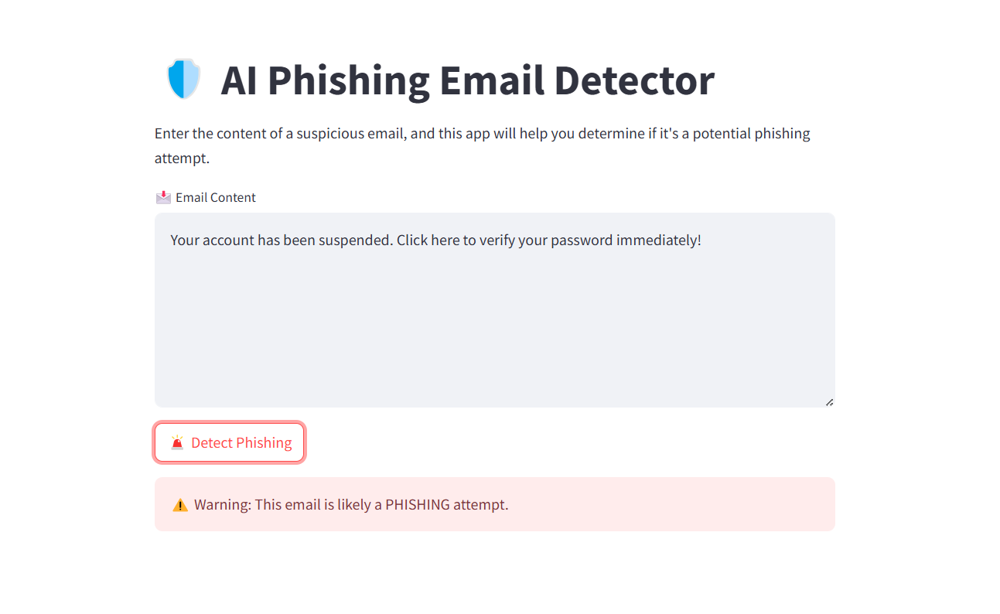
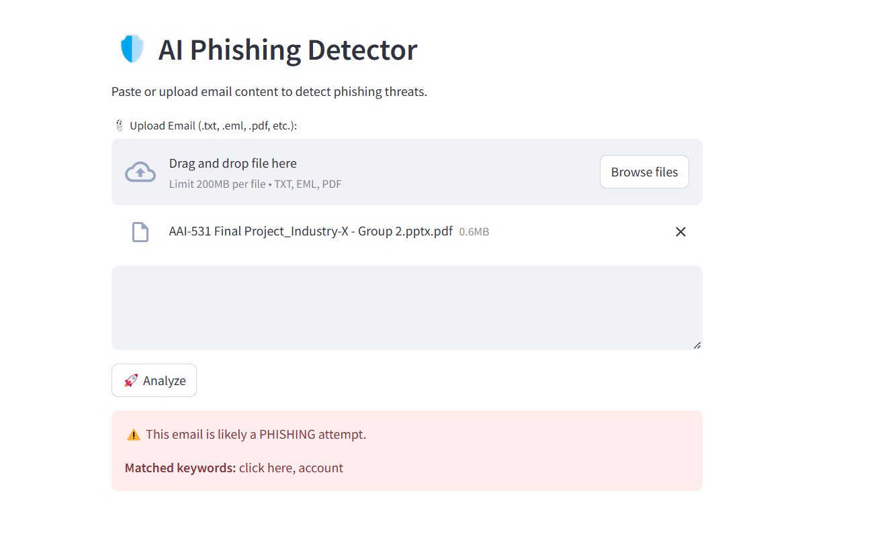

# 🛡️ BitShadow — AI Phishing Detector

A practical phishing-email detection system that combines **rule-based security heuristics + ML classification** with a clean **Streamlit UI** and optional **FastAPI endpoint**.

> Built for real-world use: handles multiple file formats, normalizes/translate text, extracts URLs, scores risk, and explains *why* an email is flagged.

## Key features

- **Hybrid detection**: rule-based scoring + ML model prediction
- **Explainable results**: reasons list (keywords, obfuscation patterns, social engineering cues)
- **Multi-format input**: paste text or upload `.txt`, `.pdf`, `.eml`, `.msg`
- **Multilingual support**: auto-detect + translate to English before analysis
- **URL extraction + basic link checks**
- **Logging**: local runtime logs (gitignored)

## Project structure

- `app.py` — Streamlit UI
- `api.py` — FastAPI endpoint (`/detect`)
- `detector.py` — main detection pipeline (rules + ML)
- `extract.py`, `attachment_handler.py` — file parsing helpers
- `train_model.py`, `retrain_model.py` — training utilities

## Run locally (Windows CMD)

### 1) Install

```bat
python -m venv venv
venv\Scripts\activate
pip install -r requirements.txt
```

### 2) Launch the UI

```bat
streamlit run app.py
```

### 3) (Optional) Run the API

```bat
uvicorn api:app --reload --port 8000
```

Then POST to `http://127.0.0.1:8000/detect` with:

```json
{ "content": "paste email body here" }
```

## Email inbox checking (optional)

If you want to run the IMAP checkers (`email_checker.py` / `email_auto_checker.py`), set credentials via environment variables or a local `.env` file.

1) Copy `.env.example` → `.env`
2) Fill in `EMAIL_USER` and a **Gmail App Password**

> ⚠️ Never commit `.env` to GitHub.

## Screenshots





## Notes

- The ML model is downloaded on first run (see `detector.py`).
- Runtime outputs (`logs/`, `temp/`, etc.) are excluded via `.gitignore`.
- Tool Link: https://bitshadow.dev/
  
